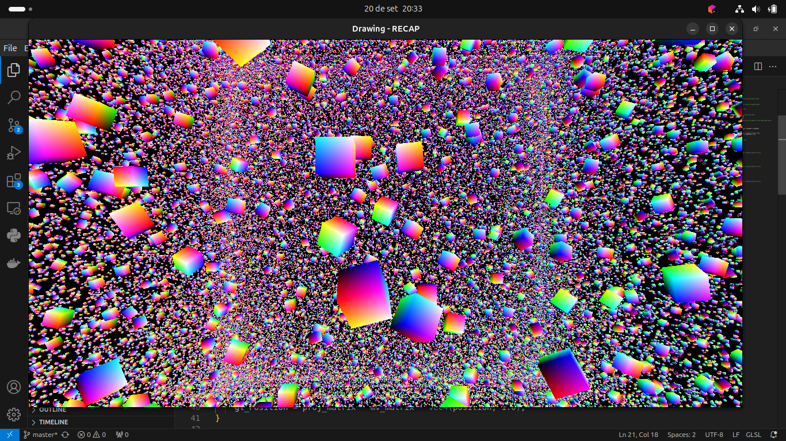

# instancing in opengl 

for optimal performance when creating multiple objects that share similar traits we can use instancing, for example when creating trees in a forest, multiple cars in a game, grass, multiple enemies like in a zombie game, etc.

### Demo image

This code creates 300.000 cubes using instancing.



It uses the build-in glsl variable ```gl_InstanceID``` to get the id of the object being rendered and allow us to make different transformations for each based on their ID.

```
    float i = gl_InstanceID + tf; // value based on time factor 
    float a = sin(203.0 * i/8000.0) * 403.0;
    float b = sin(301.0 * i/4001.0) * 401.0;
    float c = sin(400.0 * i/6003.0) * 405.0;
```    

The code for the transformations:

```
    // build the rotation and translation matrices to be applied to this cube’s model matrix
    mat4 localRotX = buildRotateX(1000*i);
    mat4 localRotY = buildRotateY(1000*i);
    mat4 localRotZ = buildRotateZ(1000*i);
    mat4 localTrans = buildTranslate(a,b,c);

    // build the model matrix
    mat4 newM_matrix = localTrans * localRotX * localRotY * localRotZ;
    mat4 mv_matrix = v_matrix * newM_matrix;

    //sent_color = vertex_color;
    varyingColor = vec4(position, 1.0) * 0.5 + vec4(0.5, 0.5, 0.5, 0.5);
    gl_Position = proj_matrix * mv_matrix * vec4(position, 1.0);
```